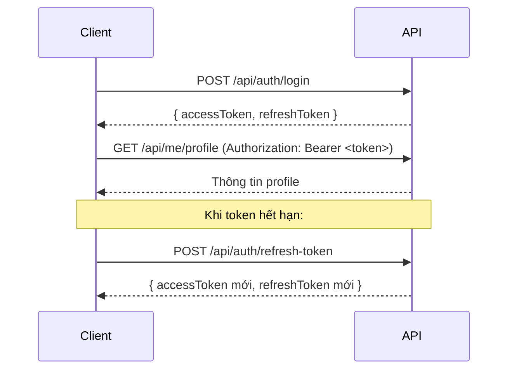

# 📚 API Documentation — University Management System

> **Base URL:** `http://localhost:8080`  
> **Content-Type:** `application/json`

---

## 🔐 Xác thực (Authentication)

Hầu hết các API yêu cầu JWT Token trong header:

```
Authorization: Bearer <access_token>
```

API trả về cấu trúc thống nhất:
```json
{
  "status": 200,
  "message": "...",
  "data": { ... }
}
```

---

## 1. 🔑 Module Auth — Xác thực & Quản lý Tài khoản

**Base path:** `/api/auth`

### Đăng nhập
```
POST /api/auth/login
```
**Body:**
```json
{
  "username": "admin",
  "password": "123456"
}
```
**Trả về:** `{ accessToken, refreshToken, tokenType, userId, username, roles }`

---

### Đăng ký tài khoản
```
POST /api/auth/register
```
**Body:**
```json
{
  "username": "newuser",
  "email": "user@example.com",
  "password": "Password@123"
}
```
**Trả về:** 201 Created — Cần xác thực email bằng OTP.

---

### Đăng xuất
```
POST /api/auth/logout
```
**Body:**
```json
{
  "refreshToken": "<refresh_token>"
}
```

---

### Làm mới Token
```
POST /api/auth/refresh-token
```
**Body:**
```json
{
  "refreshToken": "<refresh_token>"
}
```
**Trả về:** `{ accessToken, refreshToken }`

---

### Xác thực Email (OTP)
```
POST /api/auth/verify-email
```
**Body:**
```json
{
  "email": "user@example.com",
  "otp": "123456"
}
```

---

### Gửi lại OTP
```
POST /api/auth/resend-otp
```
**Body:**
```json
{
  "email": "user@example.com"
}
```

---

### Quên mật khẩu
```
POST /api/auth/forgot-password
```
**Body:**
```json
{
  "email": "user@example.com"
}
```

---

### Đặt lại mật khẩu
```
POST /api/auth/reset-password
```
**Body:**
```json
{
  "email": "user@example.com",
  "otp": "123456",
  "newPassword": "NewPass@123"
}
```

---

### Đổi mật khẩu (yêu cầu đăng nhập)
```
POST /api/auth/change-password
Authorization: Bearer <token>
```
**Body:**
```json
{
  "oldPassword": "OldPass@123",
  "newPassword": "NewPass@123"
}
```

---

### Quản lý Users (Admin/Manager)

| Method | Endpoint | Mô tả |
|--------|----------|-------|
| GET | `/api/auth/users` | Lấy tất cả users |
| GET | `/api/auth/users/{id}` | Lấy user theo ID |
| POST | `/api/auth/users` | Tạo user mới |
| PUT | `/api/auth/users/{id}` | Cập nhật user |
| DELETE | `/api/auth/users/{id}` | Xóa user |

**Body tạo/cập nhật user:**
```json
{
  "username": "sinhvien01",
  "email": "sv01@edu.vn",
  "password": "Pass@123",
  "roles": ["STUDENT"],
  "isActive": true
}
```

---

## 2. 📋 Module Audit Log — Nhật ký hệ thống

**Base path:** `/api/admin/audit-logs`  
**Yêu cầu:** Role `ADMIN`

| Method | Endpoint | Mô tả |
|--------|----------|-------|
| GET | `/api/admin/audit-logs` | Lấy log (có phân trang, lọc) |
| GET | `/api/admin/audit-logs/analytics/status` | Thống kê log theo HTTP status |
| GET | `/api/admin/audit-logs/analytics/entities` | Thống kê log theo entity |
| GET | `/api/admin/audit-logs/analytics/slow-apis` | Top 10 API phản hồi chậm |

**Query params cho GET /audit-logs:**
- `page` (default: 0), `size` (default: 20)
- `username`: lọc theo username
- `status`: `FAILED` để lấy log lỗi

---

## 3. 👨‍🎓 Module Student — Quản lý Sinh viên

**Base path:** `/api/students`

| Method | Endpoint | Mô tả |
|--------|----------|-------|
| POST | `/api/students` | Tạo sinh viên mới (tự tạo tài khoản) |
| GET | `/api/students` | Lấy tất cả sinh viên |
| GET | `/api/students/{id}` | Lấy theo ID |
| GET | `/api/students/code/{studentCode}` | Lấy theo mã SV |
| PUT | `/api/students/{id}` | Cập nhật thông tin |
| DELETE | `/api/students/{id}` | Xóa mềm |
| PATCH | `/api/students/{id}/status` | Thay đổi trạng thái active |

**Body tạo/cập nhật sinh viên:**
```json
{
  "studentCode": "SV001",
  "fullName": "Nguyễn Văn A",
  "dateOfBirth": "2002-05-15",
  "gender": 1,
  "email": "sva@edu.vn",
  "phone": "0901234567",
  "address": "HCM",
  "majorId": "uuid-of-major",
  "studentClassId": "uuid-of-class",
  "userId": null
}
```

**Body thay đổi trạng thái:**
```json
{
  "isActive": false
}
```

---

### API cho Sinh viên đang đăng nhập

**Base path:** `/api/me`  
**Yêu cầu:** Đăng nhập với vai trò STUDENT

| Method | Endpoint | Mô tả |
|--------|----------|-------|
| GET | `/api/me/profile` | Lấy thông tin hồ sơ cá nhân |
| GET | `/api/me/schedule` | Lấy lịch học học kỳ hiện tại |

---

### Trạng thái Sinh viên

**Base path:** `/api/student-status`

| Method | Endpoint | Mô tả |
|--------|----------|-------|
| POST | `/api/student-status` | Thêm trạng thái mới |
| GET | `/api/student-status` | Lấy tất cả trạng thái |
| GET | `/api/student-status/student/{studentId}` | Lấy trạng thái theo SV |
| PUT | `/api/student-status/{id}` | Cập nhật |
| DELETE | `/api/student-status/{id}` | Xóa mềm |

---

### Lớp Sinh viên (Student Classes)

**Base path:** `/api/student-classes`

| Method | Endpoint | Mô tả |
|--------|----------|-------|
| POST | `/api/student-classes` | Tạo lớp mới |
| GET | `/api/student-classes` | Lấy tất cả lớp (có thể lọc theo ?departmentId=&majorId=) |
| GET | `/api/student-classes/{id}` | Lấy chi tiết lớp |
| PUT | `/api/student-classes/{id}` | Cập nhật |
| DELETE | `/api/student-classes/{id}` | Xóa mềm |

---

### Phân công Sinh viên vào Lớp

**Base path:** `/api/student-class-sections`

| Method | Endpoint | Mô tả |
|--------|----------|-------|
| POST | `/api/student-class-sections` | Thêm SV vào lớp |
| GET | `/api/student-class-sections` | Lấy tất cả |
| GET | `/api/student-class-sections/student/{studentId}` | Lấy lớp của SV |
| GET | `/api/student-class-sections/class/{studentClassesId}` | Lấy SV trong lớp |
| PUT | `/api/student-class-sections/{id}` | Cập nhật |
| DELETE | `/api/student-class-sections/{id}` | Xóa |

---

### Cố vấn Học tập

**Base path:** `/api/advisor-class-sections`

| Method | Endpoint | Mô tả |
|--------|----------|-------|
| POST | `/api/advisor-class-sections` | Gán cố vấn cho lớp |
| GET | `/api/advisor-class-sections` | Lấy tất cả |
| GET | `/api/advisor-class-sections/advisor/{advisorId}` | Lớp của cố vấn |
| GET | `/api/advisor-class-sections/class/{studentClassesId}` | Cố vấn của lớp |
| PUT | `/api/advisor-class-sections/{id}` | Cập nhật |
| DELETE | `/api/advisor-class-sections/{id}` | Xóa |

---

## 4. 🏫 Module Academic — Năm học, Học kỳ, Lớp Học phần

### Năm học

**Base path:** `/api/academic-years`

| Method | Endpoint | Mô tả |
|--------|----------|-------|
| POST | `/api/academic-years` | Tạo năm học |
| GET | `/api/academic-years` | Lấy tất cả |
| GET | `/api/academic-years/{id}` | Lấy theo ID |
| PUT | `/api/academic-years/{id}` | Cập nhật |
| DELETE | `/api/academic-years/{id}` | Xóa |

---

### Học kỳ

**Base path:** `/api/semesters`

| Method | Endpoint | Mô tả |
|--------|----------|-------|
| POST | `/api/semesters` | Tạo học kỳ |
| GET | `/api/semesters` | Lấy tất cả |
| GET | `/api/semesters/{id}` | Lấy theo ID |
| PUT | `/api/semesters/{id}` | Cập nhật |
| DELETE | `/api/semesters/{id}` | Xóa |

---

### Lớp Học phần (Course Sections)

**Base path:** `/api/course-sections`

| Method | Endpoint | Mô tả |
|--------|----------|-------|
| POST | `/api/course-sections` | Tạo lớp học phần |
| GET | `/api/course-sections` | Lấy tất cả |
| GET | `/api/course-sections/{id}` | Lấy theo ID |
| PUT | `/api/course-sections/{id}` | Cập nhật |
| DELETE | `/api/course-sections/{id}` | Xóa |

**Body tạo lớp học phần:**
```json
{
  "classCode": "CS301-01",
  "courseId": "uuid-course",
  "semesterId": "uuid-semester",
  "academicYear": "2024-2025",
  "lecturerId": "uuid-lecturer",
  "maxStudents": 40,
  "classType": "LT"
}
```

---

### Phân công Giảng viên — Lớp học phần

**Base path:** `/api/lecturer-course-classes`

| Method | Endpoint | Mô tả |
|--------|----------|-------|
| POST | `/api/lecturer-course-classes` | Phân công GV |
| GET | `/api/lecturer-course-classes` | Lấy tất cả |
| GET | `/api/lecturer-course-classes/{id}` | Lấy theo ID |
| DELETE | `/api/lecturer-course-classes/{id}` | Xóa |

---

### Sinh viên đăng ký Lớp học phần

**Base path:** `/api/student-course-sections`

| Method | Endpoint | Mô tả |
|--------|----------|-------|
| POST | `/api/student-course-sections` | Đăng ký (gán SV vào lớp HP) |
| GET | `/api/student-course-sections` | Lấy tất cả |
| GET | `/api/student-course-sections/{id}` | Lấy theo ID |
| DELETE | `/api/student-course-sections/{id}` | Xóa |

---

## 5. 📖 Module Curriculum — Chương trình Đào tạo

### Ngành học (Majors)

**Base path:** `/api/majors`

| Method | Endpoint | Mô tả |
|--------|----------|-------|
| POST | `/api/majors` | Tạo ngành |
| GET | `/api/majors` | Lấy tất cả |
| GET | `/api/majors/{id}` | Lấy theo ID |
| PUT | `/api/majors/{id}` | Cập nhật |
| DELETE | `/api/majors/{id}` | Xóa |

---

### Học phần (Courses)

**Base path:** `/api/courses`

| Method | Endpoint | Mô tả |
|--------|----------|-------|
| POST | `/api/courses` | Tạo học phần |
| GET | `/api/courses` | Lấy tất cả |
| GET | `/api/courses/{id}` | Lấy theo ID |
| PUT | `/api/courses/{id}` | Cập nhật |
| DELETE | `/api/courses/{id}` | Xóa |

**Body tạo học phần:**
```json
{
  "code": "CS301",
  "name": "Lập trình Java",
  "credits": 3.0,
  "courseType": "BB",
  "theoryHours": 30,
  "practiceHours": 15,
  "departmentId": "uuid-dept"
}
```

---

### Học phần Điều kiện Tiên quyết

**Base path:** `/api/course-prerequisites`

| Method | Endpoint | Mô tả |
|--------|----------|-------|
| POST | `/api/course-prerequisites` | Khai báo tiên quyết |
| GET | `/api/course-prerequisites` | Lấy tất cả |
| GET | `/api/course-prerequisites/{id}` | Lấy theo ID |
| DELETE | `/api/course-prerequisites/{id}` | Xóa |

---

### Chương trình Đào tạo

**Base path:** `/api/training-programs`

| Method | Endpoint | Mô tả |
|--------|----------|-------|
| POST | `/api/training-programs` | Tạo chương trình |
| GET | `/api/training-programs` | Lấy tất cả |
| GET | `/api/training-programs/{id}` | Lấy theo ID |
| PUT | `/api/training-programs/{id}` | Cập nhật |
| DELETE | `/api/training-programs/{id}` | Xóa |

---

### Học phần trong Chương trình Đào tạo

**Base path:** `/api/training-program-courses`

| Method | Endpoint | Mô tả |
|--------|----------|-------|
| POST | `/api/training-program-courses` | Thêm HP vào CTDT |
| GET | `/api/training-program-courses` | Lấy tất cả |
| GET | `/api/training-program-courses/{id}` | Lấy theo ID |
| PUT | `/api/training-program-courses/{id}` | Cập nhật |
| DELETE | `/api/training-program-courses/{id}` | Xóa |

---

## 6. 🗓️ Module Schedule — Lịch học & Cơ sở vật chất

### Tòa nhà

**Base path:** `/api/buildings`

| Method | Endpoint | Mô tả |
|--------|----------|-------|
| POST | `/api/buildings` | Tạo tòa nhà |
| GET | `/api/buildings` | Lấy tất cả |
| GET | `/api/buildings/{id}` | Lấy theo ID |
| PUT | `/api/buildings/{id}` | Cập nhật |
| DELETE | `/api/buildings/{id}` | Xóa |

---

### Phòng học

**Base path:** `/api/rooms`

| Method | Endpoint | Mô tả |
|--------|----------|-------|
| POST | `/api/rooms` | Tạo phòng |
| GET | `/api/rooms` | Lấy tất cả |
| GET | `/api/rooms/{id}` | Lấy theo ID |
| PUT | `/api/rooms/{id}` | Cập nhật |
| DELETE | `/api/rooms/{id}` | Xóa |

---

### Tiết học (Time Slots)

**Base path:** `/api/time-slots`

| Method | Endpoint | Mô tả |
|--------|----------|-------|
| POST | `/api/time-slots` | Tạo tiết học |
| GET | `/api/time-slots` | Lấy tất cả |
| GET | `/api/time-slots/{id}` | Lấy theo ID |
| PUT | `/api/time-slots/{id}` | Cập nhật |
| DELETE | `/api/time-slots/{id}` | Xóa |

---

### Lịch học (Schedules)

**Base path:** `/api/schedules`

| Method | Endpoint | Mô tả |
|--------|----------|-------|
| POST | `/api/schedules` | Tạo lịch học |
| GET | `/api/schedules` | Lấy tất cả |
| GET | `/api/schedules/{id}` | Lấy theo ID |
| PUT | `/api/schedules/{id}` | Cập nhật |
| DELETE | `/api/schedules/{id}` | Xóa |

**Body tạo lịch:**
```json
{
  "courseSectionId": "uuid-section",
  "lecturerId": "uuid-lecturer",
  "roomId": "uuid-room",
  "dayOfWeek": 2,
  "date": "2025-01-13",
  "shift": "SA",
  "startPeriod": 1,
  "endPeriod": 3,
  "startDate": "2025-01-06T00:00:00",
  "endDate": "2025-05-31T00:00:00"
}
```

---

## 7. 📝 Module Registration — Đăng ký Học phần

### Đợt đăng ký

**Base path:** `/api/registration-periods`

| Method | Endpoint | Mô tả |
|--------|----------|-------|
| POST | `/api/registration-periods` | Tạo đợt đăng ký |
| GET | `/api/registration-periods` | Lấy tất cả |
| GET | `/api/registration-periods/{id}` | Lấy theo ID |
| PUT | `/api/registration-periods/{id}` | Cập nhật |
| DELETE | `/api/registration-periods/{id}` | Xóa |

**Body:**
```json
{
  "semesterId": "uuid-semester",
  "name": "Đợt đăng ký 1 - HK1 2024-2025",
  "startTime": "2024-11-01T08:00:00",
  "endTime": "2024-11-07T23:59:59",
  "isActive": true
}
```

---

### Đăng ký Học phần

**Base path:** `/api/course-registrations`

| Method | Endpoint | Mô tả |
|--------|----------|-------|
| POST | `/api/course-registrations` | Đăng ký học phần |
| GET | `/api/course-registrations` | Lấy tất cả |
| GET | `/api/course-registrations/{id}` | Lấy theo ID |
| PUT | `/api/course-registrations/{id}` | Cập nhật (thay đổi trạng thái) |
| DELETE | `/api/course-registrations/{id}` | Hủy đăng ký |

**Body:**
```json
{
  "studentId": "uuid-student",
  "courseSectionId": "uuid-section",
  "registrationPeriodId": "uuid-period",
  "status": 1
}
```

---

### Học phần Tương đương

**Base path:** `/api/equivalent-courses`

| Method | Endpoint | Mô tả |
|--------|----------|-------|
| POST | `/api/equivalent-courses` | Khai báo học phần tương đương |
| GET | `/api/equivalent-courses` | Lấy tất cả |
| GET | `/api/equivalent-courses/{id}` | Lấy theo ID |
| DELETE | `/api/equivalent-courses/{id}` | Xóa |

---

## 8. 📊 Module Grading — Điểm số

### Thang điểm (Grade Scales)

**Base path:** `/api/grade-scales`

| Method | Endpoint | Mô tả |
|--------|----------|-------|
| POST | `/api/grade-scales` | Tạo thang điểm |
| GET | `/api/grade-scales` | Lấy tất cả |
| GET | `/api/grade-scales/{id}` | Lấy theo ID |
| PUT | `/api/grade-scales/{id}` | Cập nhật |
| DELETE | `/api/grade-scales/{id}` | Xóa |

---

### Thành phần điểm (Grade Components)

**Base path:** `/api/grade-components`

| Method | Endpoint | Mô tả |
|--------|----------|-------|
| POST | `/api/grade-components` | Tạo thành phần điểm |
| GET | `/api/grade-components/course-section/{courseSectionId}` | Lấy theo lớp HP |
| PUT | `/api/grade-components/{id}` | Cập nhật |
| DELETE | `/api/grade-components/{id}` | Xóa |

**Body:**
```json
{
  "courseSectionId": "uuid-section",
  "name": "Bài kiểm tra giữa kỳ",
  "weight": 0.3,
  "gradeScaleId": "uuid-scale"
}
```

---

### Điểm thành phần của Sinh viên

**Base path:** `/api/student-component-grades`

| Method | Endpoint | Mô tả |
|--------|----------|-------|
| POST | `/api/student-component-grades` | Nhập/Cập nhật điểm thành phần |
| GET | `/api/student-component-grades/registration/{registrationId}` | Lấy điểm theo đăng ký |
| DELETE | `/api/student-component-grades/{id}` | Xóa |

---

### Tổng kết Điểm (Student Summaries)

**Base path:** `/api/student-summaries`

| Method | Endpoint | Mô tả |
|--------|----------|-------|
| POST | `/api/student-summaries` | Tính/Cập nhật điểm tổng kết |
| GET | `/api/student-summaries/registration/{registrationId}` | Lấy điểm tổng kết |
| DELETE | `/api/student-summaries/{id}` | Xóa |

---

## 9. 💰 Module Finance — Tài chính, Học phí

### Bảng giá Học phí

**Base path:** `/api/tuition-fees`

| Method | Endpoint | Mô tả |
|--------|----------|-------|
| POST | `/api/tuition-fees` | Tạo bảng giá |
| GET | `/api/tuition-fees` | Lấy tất cả |
| GET | `/api/tuition-fees/{id}` | Lấy theo ID |
| PUT | `/api/tuition-fees/{id}` | Cập nhật |
| DELETE | `/api/tuition-fees/{id}` | Xóa |

---

### Học phí Sinh viên

**Base path:** `/api/student-tuitions`

| Method | Endpoint | Mô tả |
|--------|----------|-------|
| POST | `/api/student-tuitions` | Tạo bản ghi học phí |
| GET | `/api/student-tuitions/student/{studentId}` | Học phí theo SV |
| GET | `/api/student-tuitions/semester/{semesterId}` | Học phí theo học kỳ |
| PUT | `/api/student-tuitions/{id}` | Cập nhật |
| DELETE | `/api/student-tuitions/{id}` | Xóa |

---

### Thanh toán

**Base path:** `/api/payments`

| Method | Endpoint | Mô tả |
|--------|----------|-------|
| POST | `/api/payments` | Ghi nhận thanh toán |
| GET | `/api/payments/tuition/{studentTuitionId}` | Lấy lịch sử thanh toán |
| DELETE | `/api/payments/{id}` | Xóa |

**Body:**
```json
{
  "studentTuitionId": "uuid-tuition",
  "amount": 5000000,
  "paymentMethod": "BANK_TRANSFER",
  "transactionId": "TXN20241101001",
  "paidAt": "2024-11-01T10:00:00"
}
```

---

## 10. 👥 Module HR — Nhân sự

### Phòng/Khoa (Departments)

**Base path:** `/api/departments`

| Method | Endpoint | Mô tả |
|--------|----------|-------|
| POST | `/api/departments` | Tạo phòng/khoa |
| GET | `/api/departments` | Lấy tất cả |
| GET | `/api/departments/{id}` | Lấy theo ID |
| GET | `/api/departments/code/{code}` | Lấy theo mã |
| PUT | `/api/departments/{id}` | Cập nhật |
| DELETE | `/api/departments/{id}` | Xóa |

---

### Chức vụ (Positions)

**Base path:** `/api/positions`

| Method | Endpoint | Mô tả |
|--------|----------|-------|
| POST | `/api/positions` | Tạo chức vụ |
| GET | `/api/positions` | Lấy tất cả |
| GET | `/api/positions/{id}` | Lấy theo ID |
| GET | `/api/positions/code/{code}` | Lấy theo mã |
| PUT | `/api/positions/{id}` | Cập nhật |
| DELETE | `/api/positions/{id}` | Xóa |

---

### Nhân viên / Giảng viên (Employees)

**Base path:** `/api/employees`

| Method | Endpoint | Mô tả |
|--------|----------|-------|
| POST | `/api/employees` | Tạo nhân viên/GV |
| GET | `/api/employees` | Lấy tất cả |
| GET | `/api/employees/{id}` | Lấy theo ID |
| GET | `/api/employees/code/{code}` | Lấy theo mã nhân viên |
| PUT | `/api/employees/{id}` | Cập nhật |
| DELETE | `/api/employees/{id}` | Xóa mềm |
| PATCH | `/api/employees/{id}/status` | Thay đổi trạng thái |

**Body:**
```json
{
  "employeeCode": "GV001",
  "fullName": "Trần Văn B",
  "email": "gvb@edu.vn",
  "phone": "0912345678",
  "departmentId": "uuid-dept",
  "positionId": "uuid-position",
  "employeeType": "LECTURER",
  "isActive": true
}
```

---

## 11. 📝 Module Examination — Thi cử

### Loại hình Thi (Exam Types)

**Base path:** `/api/exam-types`

| Method | Endpoint | Mô tả |
|--------|----------|-------|
| POST | `/api/exam-types` | Tạo loại thi |
| GET | `/api/exam-types` | Lấy tất cả |
| GET | `/api/exam-types/{id}` | Lấy theo ID |
| PUT | `/api/exam-types/{id}` | Cập nhật |
| DELETE | `/api/exam-types/{id}` | Xóa |

---

### Lịch thi (Exams)

**Base path:** `/api/exams`

| Method | Endpoint | Mô tả |
|--------|----------|-------|
| POST | `/api/exams` | Tạo lịch thi |
| GET | `/api/exams` | Lấy tất cả |
| GET | `/api/exams/{id}` | Lấy theo ID |
| PUT | `/api/exams/{id}` | Cập nhật |
| DELETE | `/api/exams/{id}` | Xóa |

**Body:**
```json
{
  "courseSectionId": "uuid-section",
  "examTypeId": "uuid-exam-type",
  "examDate": "2025-05-20",
  "startTime": "07:30",
  "duration": 90,
  "semesterId": "uuid-semester"
}
```

---

### Phòng thi

**Base path:** `/api/exam-rooms`

| Method | Endpoint | Mô tả |
|--------|----------|-------|
| POST | `/api/exam-rooms` | Thêm phòng thi |
| GET | `/api/exam-rooms/exam/{examId}` | Phòng thi theo ca thi |
| DELETE | `/api/exam-rooms/{id}` | Xóa |

---

### Đề thi

**Base path:** `/api/exam-papers`

| Method | Endpoint | Mô tả |
|--------|----------|-------|
| POST | `/api/exam-papers` | Tạo đề thi |
| GET | `/api/exam-papers/exam/{examId}` | Đề thi theo ca thi |
| DELETE | `/api/exam-papers/{id}` | Xóa |

---

### Đăng ký Thi

**Base path:** `/api/exam-registrations`

| Method | Endpoint | Mô tả |
|--------|----------|-------|
| POST | `/api/exam-registrations` | Đăng ký thi |
| GET | `/api/exam-registrations/exam/{examId}` | SV đăng ký ca thi |
| GET | `/api/exam-registrations/student/{studentId}` | Lịch thi của SV |
| DELETE | `/api/exam-registrations/{id}` | Hủy đăng ký thi |

---

### Kết quả Thi

**Base path:** `/api/exam-results`

| Method | Endpoint | Mô tả |
|--------|----------|-------|
| POST | `/api/exam-results` | Nhập/Cập nhật kết quả |
| GET | `/api/exam-results/registration/{registrationId}` | Kết quả theo đăng ký thi |
| DELETE | `/api/exam-results/{id}` | Xóa |

---

## 12. 🎓 Module Graduation — Tốt nghiệp

### Điều kiện Tốt nghiệp

**Base path:** `/api/graduation-conditions`

| Method | Endpoint | Mô tả |
|--------|----------|-------|
| POST | `/api/graduation-conditions` | Tạo điều kiện tốt nghiệp |
| GET | `/api/graduation-conditions` | Lấy tất cả |
| GET | `/api/graduation-conditions/{id}` | Lấy theo ID |
| PUT | `/api/graduation-conditions/{id}` | Cập nhật |
| DELETE | `/api/graduation-conditions/{id}` | Xóa |

**Body:**
```json
{
  "trainingProgramId": "uuid-program",
  "minCredits": 130,
  "minGPA": 2.0,
  "description": "Tốt nghiệp hệ Đại học chính quy"
}
```

---

### Kết quả Tốt nghiệp

**Base path:** `/api/graduation-results`

| Method | Endpoint | Mô tả |
|--------|----------|-------|
| POST | `/api/graduation-results` | Ghi nhận kết quả TN |
| GET | `/api/graduation-results/student/{studentId}` | Kết quả theo SV |
| DELETE | `/api/graduation-results/{id}` | Xóa |

---

## 13. 🔔 Module System — Hệ thống & Thông báo

### Dashboard (Admin only)

```
GET /api/admin/dashboard/stats
Authorization: Bearer <admin_token>
```
**Trả về:** Thống kê tổng số SV, GV, học phần, đăng ký học phần...

---

### Cài đặt Hệ thống

**Base path:** `/api/settings`

| Method | Endpoint | Mô tả |
|--------|----------|-------|
| POST | `/api/settings` | Tạo/Cập nhật cài đặt |
| GET | `/api/settings` | Lấy tất cả cài đặt |
| GET | `/api/settings/{key}` | Lấy theo key |

---

### Thông báo (Notifications)

**Base path:** `/api/notifications`

| Method | Endpoint | Mô tả |
|--------|----------|-------|
| POST | `/api/notifications` | Tạo thông báo |
| GET | `/api/notifications` | Lấy tất cả |
| DELETE | `/api/notifications/{id}` | Xóa |

---

### Thông báo của Người dùng

**Base path:** `/api/user-notifications`

| Method | Endpoint | Mô tả |
|--------|----------|-------|
| POST | `/api/user-notifications` | Gửi thông báo tới user |
| GET | `/api/user-notifications/user/{userId}` | Thông báo của user |
| PATCH | `/api/user-notifications/{id}/read` | Đánh dấu đã đọc |

---

## 📌 Lưu ý chung

### HTTP Status Codes

| Code | Ý nghĩa |
|------|---------|
| 200 | Thành công |
| 201 | Tạo mới thành công |
| 204 | Xóa thành công (no content) |
| 400 | Dữ liệu không hợp lệ |
| 401 | Chưa xác thực |
| 403 | Không có quyền |
| 404 | Không tìm thấy |
| 409 | Dữ liệu đã tồn tại |
| 500 | Lỗi server |

### Quy trình Xác thực điển hình



### Soft Delete

Hầu hết các entity hỗ trợ **xóa mềm** (soft delete): thay vì xóa khỏi DB, record sẽ được đánh dấu `deleted_at = now()` và `is_active = false`. API `DELETE` thường trả về `204 No Content`.
